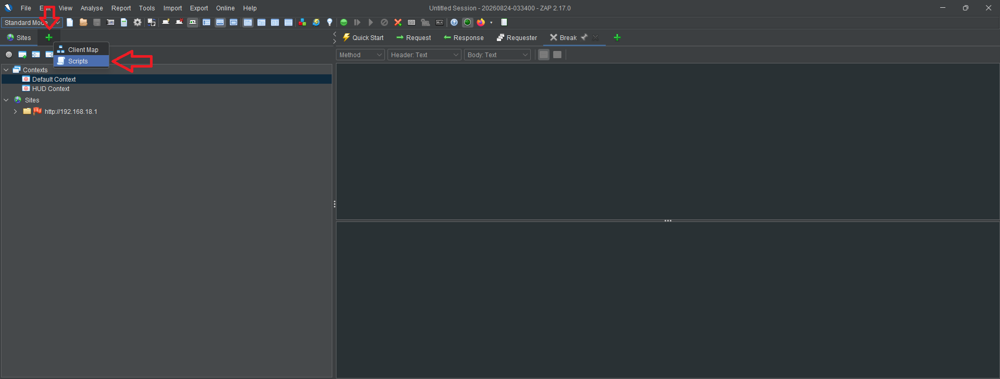
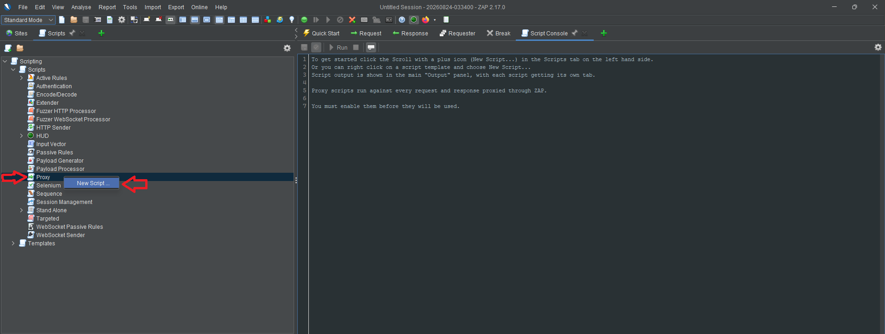
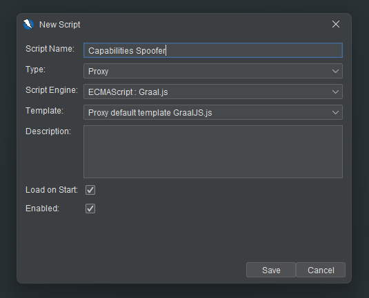
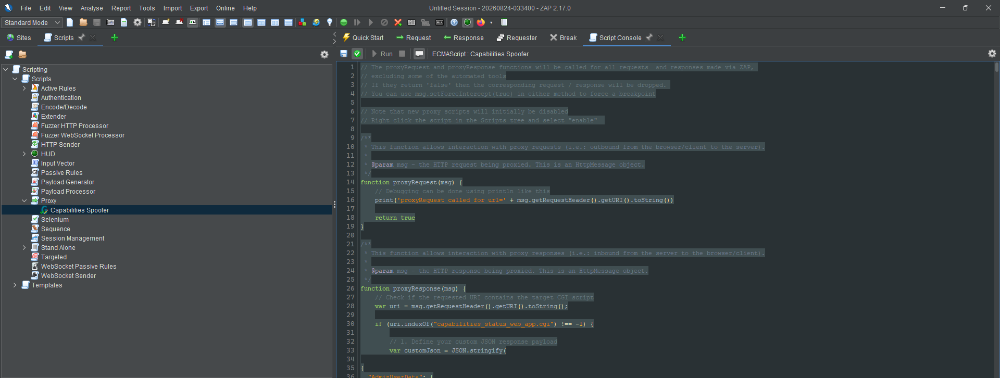
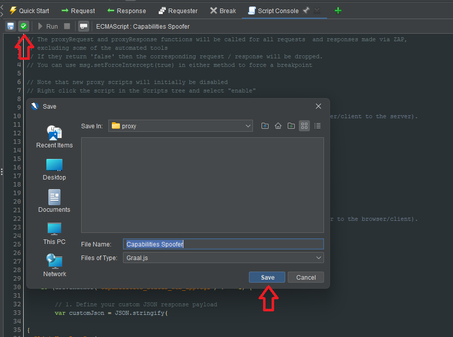
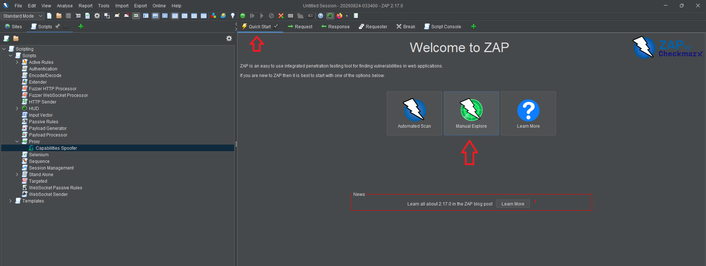
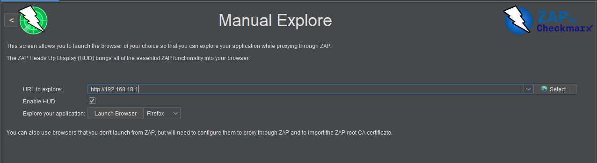

# Access more WebUI Options

The WebUI controls what pages it shows you through the response it gets from `GET /capabilities_status_web_app.cgi`

Interestingly, there are pages and options which can be configured even with the default admin account. 
Some of these pages are hidden even while you're logged in with superadmin.

Note: While this change does physically let you view more pages, and change a few additional settings, 
you can't bypass server-side permission checks, which most (but not all) of the options rely on.

This tutorial will use the [OWASP ZAP](https://www.zaproxy.org/) software

## Tutorial

1. Download and install the correct ZAP software for your version from [here](https://www.zaproxy.org/download/)
2. Open the software, and click on the PLUS icon (top left, near "Sites"), and then "Scripts"

    

3. Right click on "Proxy" and click "New Script"

    

4. In the New Script dialogue, set the following, and click Safe
    - Script Name: (anything you want)
    - Type: Proxy
    - Script Engine: ECMAScript : Graal.js
    - Template: Proxy default template GraalJS.js
    - Load on Start: (ticked)
    - Enabled: ticked

    

5. Paste the contents of [capabilities-spoofer.js](capabilities-spoofer.js) into the script console, 
    replacing all the existing code 

    

6. Click the save button, and save the script somewhere 

    

7. Go to the "Quick Start" tab and click the "Manual Explore" button

    

8. Enter your router's IP address, and click "Launch Browser"

    

There you go! Now, once you log in to your admin/superadmin account, you'll have access to all the pages.